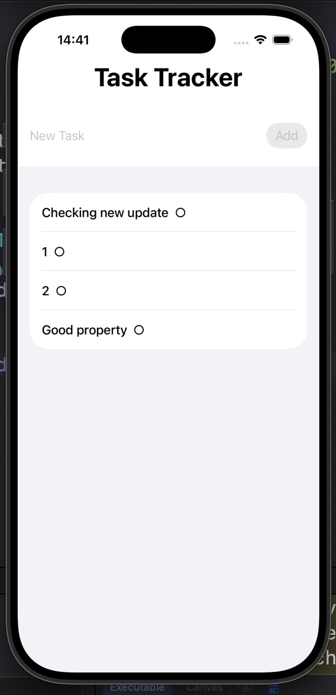
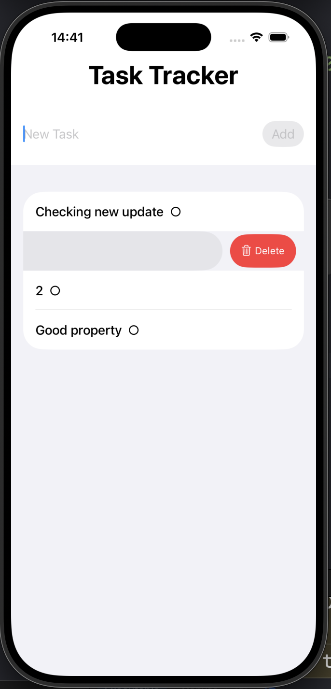
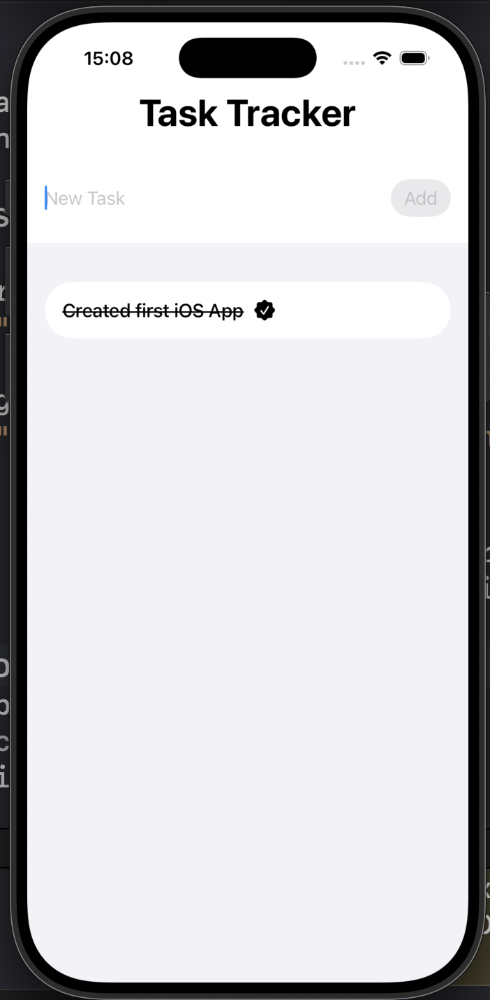

# TaskTracker

Simple iOS task management app built with SwiftUI.

## Features
- Add new tasks
- Delete tasks with swipe action
- Clean and minimal UI
- Local task state management
- Swift Data Persistence

## Tech Stack
- Swift
- SwiftUI
- State Management
- Basic Architecture

## Screenshots

### Main Screen

### Deleting Task

### Marking Task As Completed

## About
TaskTracker is a lightweight practice project focused on learning SwiftUI basics, state management, and list interactions.

## Run Project
1. Clone repository
2. Open `.xcodeproj`
3. Run on Simulator or iPhone
